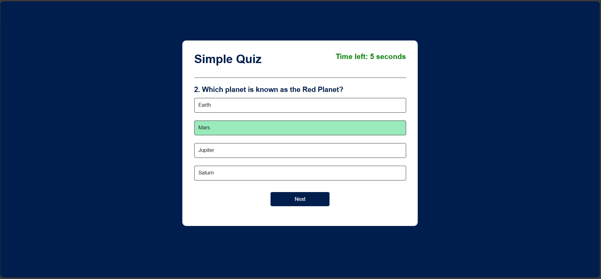

# Simple Quiz App

A simple, interactive multiple-choice quiz web application built with HTML, CSS, and JavaScript. This app allows users to answer a series of questions with a limited time for each question. The application displays the score at the end, based on the number of correct answers.

## Features

- **Multiple-choice questions**: Users can choose from 4 options for each question.
- **Timer**: Each question must be answered within 7 seconds.
- **Score Tracking**: Final score is displayed at the end.
- **User Interface**: Minimalist and user-friendly interface with real-time feedback.

## Screenshots

### Home Screen

The initial screen displays a description of the quiz, along with a button to start.

### Quiz Screen

Displays each question, answer choices, and a countdown timer.

### Score Screen

After completing the quiz, this screen shows the final score.

